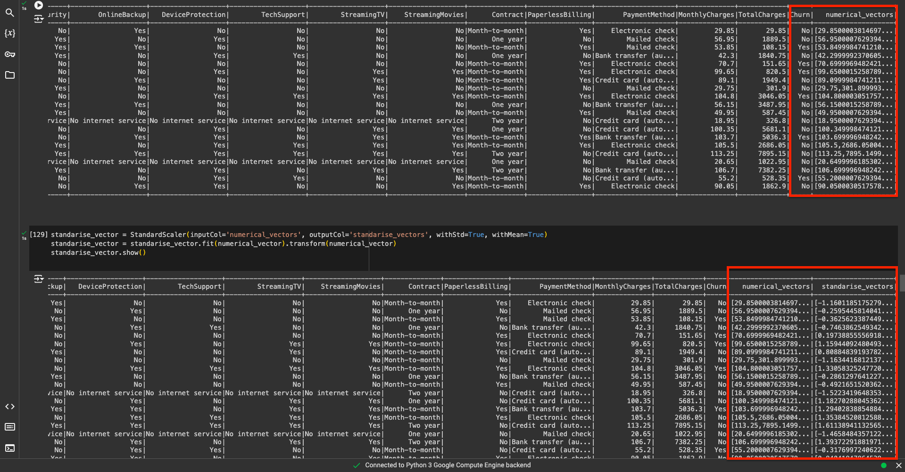
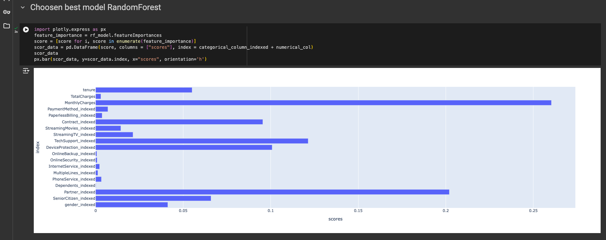
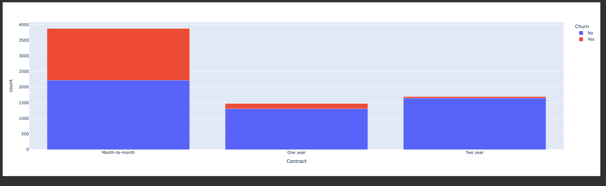

## Customer Churn Prediction Using PySpark 🤖

## Project Overview
This project focuses on predicting customer churn using PySpark. By leveraging PySpark's distributed computing capabilities, I was able to efficiently handle large-scale data, perform feature engineering, and build machine learning models to identify customers at risk of churn.

## Problem Statement
In this project, the goal was to predict customer churn based on customer data, including demographics, services used, and payment information. The aim was to identify which customers are likely to churn and provide actionable insights to reduce churn by focusing on key business factors like MonthlyCharges.

## Key Steps

## 1. Exploratory Data Analysis (EDA) 📊
   
Conducted EDA to understand data patterns, missing values, and outliers.
Standardized numerical columns (e.g., MonthlyCharges, TotalCharges) for better model performance.
Indexed and vectorized categorical columns (e.g., Contract, PaymentMethod) to convert them into numerical format.

## 3. Feature Engineering 🛠️
Combined features using VectorAssembler for both numerical and categorical columns to create a feature vector for model training.




## 5. Model Building 🤖
Built three machine learning models:

Logistic Regression
Decision Tree
Random Forest
Each model was trained on the data to predict whether a customer will churn. The models were evaluated based on the AUC (Area Under the ROC Curve).


## 4. Cross-Validation and Grid Search 🔍
Performed cross-validation and grid search to tune hyperparameters:

Logistic Regression: Tuned regParam and elasticNetParam.
Decision Tree: Tuned maxDepth and minInstancesPerNode.
Random Forest: Tuned numTrees, maxDepth, and maxBins.
This allowed me to select the best-performing model based on cross-validated AUC scores.

## 5. Feature Importance and Business Insights 📊
Using the Random Forest model, MonthlyCharges was identified as the most important feature contributing to customer churn.

## Business Insights 💡
By focusing on MonthlyCharges, I proposed a business solution to:

Convert monthly customers into long-term contract users, incentivizing them with discounts to reduce churn probability.
A visual analysis showed how transitioning customers to long-term contracts could significantly reduce churn rates.



## Impact of Monthly Charges
Customers with higher monthly charges were more likely to churn. Offering these customers long-term contracts with discounted rates can significantly reduce churn and improve customer retention.


Technologies Used
Languages: Python
Distributed Processing: PySpark
Machine Learning: PySpark's MLlib for model building
Feature Engineering: PySpark (VectorAssembler, StringIndexer, OneHotEncoder)
Evaluation Metrics: AUC, Accuracy, Precision, Recall
Cross-Validation & Grid Search: PySpark’s CrossValidator and ParamGridBuilder

## How to Use

1. Clone the repository:
   ```bash
   git clone https://github.com/KeshavSingh/Customer_churn-prediction-pyspark.git
2. Navigate to the project folder:
   ```bash
   cd Customer_Churn-Prediction-pyspark
3. Run the jupyter notebooks and apply new optimisations to test
